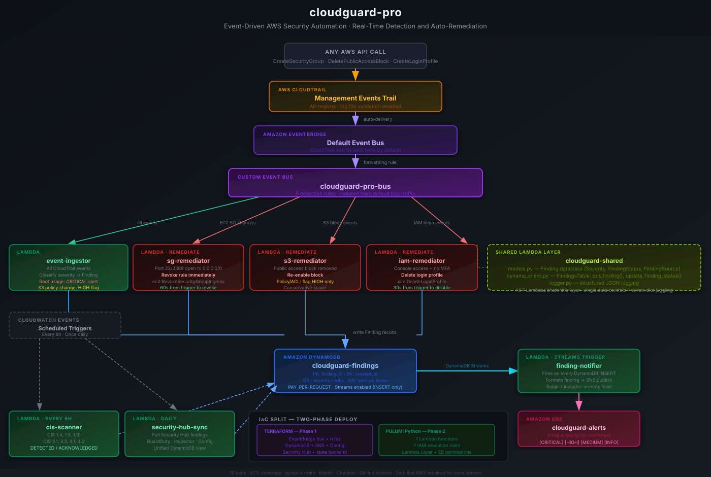

# cloudguard-pro

[](https://github.com/cypher682/cloudguard-pro/actions/workflows/ci.yml)

Event-driven AWS security automation platform. Detects and automatically remediates cloud misconfigurations in real time — not on a schedule, but within seconds of the API call that creates the problem.

Built with Python Lambda, Terraform, Pulumi, EventBridge, DynamoDB, and SNS. Every infrastructure decision is documented.

---

## What It Does

**Automatically remediates (no human in the loop):**

| Trigger | Detection Path | Action |
|---|---|---|
| Security group allows `0.0.0.0/0` on port 22 or 3389 | CloudTrail → EventBridge → sg-remediator | Rule revoked immediately |
| S3 public access block removed | CloudTrail → EventBridge → s3-remediator | Block re-enabled |
| IAM user with console access and no MFA | CloudTrail → EventBridge → iam-remediator | Console access disabled |

**Flags for human review (alert only):**

| Trigger | Severity | Why No Auto-Remediation |
|---|---|---|
| Root account usage | CRITICAL | Too sensitive to auto-act on |
| S3 bucket policy / ACL change | HIGH | Intent is ambiguous |

**Scheduled CIS AWS Foundations Benchmark checks (every 6 hours):**
CIS 1.4, 1.5, 1.10, 3.1, 3.3, 4.1, 4.2 — runs programmatically via Lambda, findings written to DynamoDB.

**Daily Security Hub aggregation:** Pulls GuardDuty, Inspector, and Config findings into a single DynamoDB view.

---

## Architecture



```
AWS API Call (any resource)
        │
        ▼
  CloudTrail (management events)
        │
        ▼
  EventBridge (default bus)
        │ forwarding rule
        ▼
  EventBridge (cloudguard-pro-bus — custom bus)
        │
   ─────┴──────────────────────────────────────
   │            │              │            │
   ▼            ▼              ▼            ▼
event-       sg-           s3-          iam-
ingestor    remediator    remediator   remediator
   │            │              │            │
   └────────────┴──────────────┴────────────┘
                       │ All write Finding records
                       ▼
             DynamoDB (cloudguard-findings)
                       │ Streams (INSERT only)
                       ▼
             finding-notifier Lambda
                       │
                       ▼
             SNS → Email Alert

CloudWatch Schedule (every 6h) → cis-scanner Lambda → DynamoDB
CloudWatch Schedule (daily)    → security-hub-sync Lambda → DynamoDB
```

The forwarding rule is a deliberate design decision: CloudTrail only delivers events to the default EventBridge bus. The custom bus (`cloudguard-pro-bus`) isolates cloudguard's rules from any other account-level EventBridge activity. All five detection rules live on the custom bus.

---

## Stack

| Layer | Tools |
|---|---|
| IaC — infrastructure | Terraform: EventBridge, DynamoDB, SNS, Config rules, Security Hub, S3 state backend |
| IaC — compute | Pulumi: Lambda functions, IAM roles, Lambda Layer, EventBridge permissions |
| Runtime | Python 3.12 Lambda |
| Storage | DynamoDB — `PAY_PER_REQUEST`, streams-enabled, two GSIs (severity-index, service-index) |
| Notifications | SNS topic → email subscription |
| Testing | pytest + moto — all 70 tests run against mocked AWS (no live account required) |
| Security scanning | Checkov (Terraform), Bandit (Python) |
| CI/CD | GitHub Actions |

See [`docs/iac-comparison.md`](docs/iac-comparison.md) for the documented rationale behind the Terraform + Pulumi split.

---

## Lambda Functions

| Function | Trigger | Responsibility |
|---|---|---|
| `event-ingestor` | EventBridge — all CloudTrail events | Parse, classify severity, write `Finding` to DynamoDB |
| `sg-remediator` | EventBridge — EC2 SG change events | Revoke 0.0.0.0/0 rules on port 22/3389 |
| `s3-remediator` | EventBridge — S3 policy/block events | Re-enable public access block |
| `iam-remediator` | EventBridge — IAM change events | Disable console access for MFA-less IAM users |
| `cis-scanner` | CloudWatch Events (every 6h) | Run CIS AWS Foundations Benchmark checks |
| `finding-notifier` | DynamoDB Streams (INSERT) | Format and publish SNS notification per finding |
| `security-hub-sync` | CloudWatch Events (daily) | Pull Security Hub findings into DynamoDB |

All seven functions share a Lambda Layer (`cloudguard-shared`) that provides:
- `models.py` — `Finding` dataclass with `Severity`, `FindingStatus`, `FindingSource` enums
- `dynamo_client.py` — `FindingsTable` wrapper: `put_finding()`, `update_finding_status()`
- `logger.py` — Structured JSON logging via `get_logger()`

No function writes raw dicts to DynamoDB. Schema drift is a dataclass validation error at test time, not a runtime surprise.

---

## Key Implementation Decisions

**Separate EventBridge bus.**
CloudTrail delivers events to the default bus only. A forwarding rule relays all CloudTrail management events to a custom bus (`cloudguard-pro-bus`). All five detection rules live on this custom bus, keeping them isolated from any other account-level EventBridge usage.

**Conservative remediation scope.**
S3 policy and ACL changes are flagged as HIGH but not auto-remediated — the intent of a policy change is ambiguous (it could be legitimate). Only the public access block (an explicit on/off control) is auto-restored. Root account usage is CRITICAL-alerted but never auto-remediated. The system is safe to run unattended.

**Dual IaC with Terraform and Pulumi.**
Terraform manages static infrastructure (EventBridge bus/rules, DynamoDB, SNS, Config, Security Hub). Pulumi manages compute (Lambda functions, IAM roles, Lambda Layer). Terraform is declarative — correct for stable resource definitions. Pulumi is imperative — better for dynamic operations like zipping source code, attaching layers, and wiring permissions to Terraform-managed resource ARNs.

**Single data contract.**
All seven Lambdas write the same `Finding` dataclass to DynamoDB. Every field is typed. Every enum is validated. No function can silently write a different shape to the table.

**Independent state backend.**
cloudguard-pro owns its own S3 state bucket and DynamoDB lock table, bootstrapped via a one-time local `terraform apply` in `terraform/modules/state-backend`. No shared state with any other project.

---

## Local Development

No AWS account or credentials required for local development. All tests run against moto-mocked AWS services.

```bash
# Install dev dependencies
pip install -r requirements-dev.txt

# Run all tests
python -m pytest tests/ -v

# Run with coverage
python -m pytest tests/ --cov=lambdas --cov-report=term-missing

# 70 tests passed — 87% coverage
```

---

## CI/CD

Workflow: [`.github/workflows/ci.yml`](.github/workflows/ci.yml)

| Job | What It Does |
|---|---|
| `test` | pytest + moto — 70 tests, 87% coverage gate |
| `scan-python` | Bandit security scan on all Lambda source |
| `scan-terraform` | Checkov IaC scan + `terraform validate` |
| `lint` | Ruff lint across all Python files |
| `deploy-tf` | `terraform apply` on merge to main (requires AWS secrets) |
| `deploy-pulumi` | `pulumi up` on merge to main (requires Pulumi token + AWS secrets) |

---

## Repo Structure

```
cloudguard-pro/
├── terraform/
│   ├── main.tf / variables.tf / outputs.tf
│   └── modules/
│       ├── dynamodb/        # Findings table + streams + GSIs
│       ├── sns/             # Alert topic + email subscription
│       ├── eventbridge/     # Custom bus + 5 rules + scheduled triggers
│       ├── config-rules/    # Config recorder + 6 managed CIS rules
│       ├── security-hub/    # Hub + CIS + AWS Foundational standards
│       └── state-backend/   # Bootstrap: S3 + DynamoDB lock (run once)
├── pulumi/
│   ├── Pulumi.yaml
│   ├── __main__.py          # 7 Lambdas + roles + layer + permissions
│   └── Pulumi.dev.yaml.example
├── lambdas/
│   ├── shared/              # Finding dataclass, DynamoDB client, logger
│   ├── event-ingestor/
│   ├── sg-remediator/
│   ├── s3-remediator/
│   ├── iam-remediator/
│   ├── cis-scanner/
│   ├── finding-notifier/
│   └── security-hub-sync/
├── tests/unit/              # 70 tests across all 7 Lambdas + shared layer
├── .github/workflows/ci.yml
└── docs/
    ├── iac-comparison.md
    ├── sprint-checklist.md
    ├── cis-checks.md
    └── evidence/
```

---

## Sprint Deployment

See [`docs/sprint-checklist.md`](docs/sprint-checklist.md) for the full deploy → verify → teardown sequence.

**Two-phase deploy:**
1. `terraform apply` — creates EventBridge bus/rules, DynamoDB, SNS, Config, Security Hub
2. `pulumi up` — creates 7 Lambda functions wired to the Terraform-managed resources

**Estimated sprint cost:** ~$3–5 for a full 2-day run with teardown.

---

## Evidence

Evidence captured during the AWS sprint — July 2026.

| Evidence | Description | Location |
|---|---|---|
| Pulumi deploy output | 37 resources created (Lambdas, Layer, IAM) | `docs/evidence/` |
| SG rule auto-revoked | Port 22 `0.0.0.0/0` rule removed in real time | `docs/evidence/` |
| IAM console disabled | Login profile deleted for MFA-less user | `docs/evidence/` |
| DynamoDB findings table | CIS scanner findings populated | `docs/evidence/` |
| SNS alert emails | CRITICAL, HIGH, MEDIUM, INFO severity alerts received | `docs/evidence/` |
| CIS scanner results | `CIS_4_1_UNRESTRICTED_PORT_22` DETECTED, `CIS_3_1_PASS` ACKNOWLEDGED | `docs/evidence/` |

> Screenshots and raw output files will be committed to `docs/evidence/` after the sprint.

---

## Security Notes

- `terraform.tfvars` — gitignored, never committed. Use `.tfvars.example` as the template.
- `Pulumi.dev.yaml` — gitignored. Pulumi stack config with ARNs stays local.
- `.env` files — gitignored.
- No static AWS credentials anywhere — CI uses GitHub Actions OIDC federated auth.
- Lambda IAM roles are least-privilege — each function has only the permissions it needs for its specific action.
