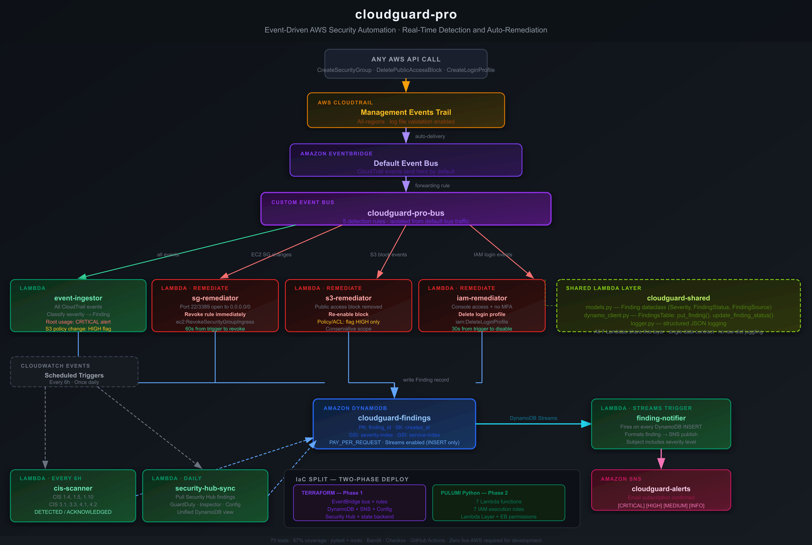

# cloudguard-pro

[](https://github.com/cypher682/cloudguard-pro/actions/workflows/ci.yml)

Production-grade, event-driven AWS security automation platform built with Python 3.12, Terraform, Pulumi, EventBridge, DynamoDB, and SNS.

CloudGuard Pro goes beyond static compliance scanning — it implements sub-minute automated remediation for critical cloud misconfigurations, event isolation via dedicated event buses, scheduled CIS AWS Foundations Benchmark audits, and daily Security Hub aggregation. Zero live AWS credentials required for development; 100% of AWS services are mocked in moto across a 70-test suite with 87% coverage.

---

## Highlights

- **Real-Time Automated Remediation:** Instant revocation of unrestricted SSH/RDP security group ingress (`0.0.0.0/0`) and immediate deletion of console access for MFA-less IAM users.
- **Dedicated EventBus Isolation:** Custom EventBridge bus (`cloudguard-pro-bus`) fed by a CloudTrail management event forwarding rule, isolating security event handling from account-level bus noise.
- **Dual Infrastructure-as-Code Strategy:** Terraform for declarative static infrastructure (EventBridge, DynamoDB, SNS, AWS Config, Security Hub) and Pulumi (Python) for dynamic compute execution (Lambdas, IAM roles, Lambda Layers).
- **Strict Single-Data-Contract Architecture:** All 7 Lambdas write to a unified, strongly-typed `Finding` dataclass schema into DynamoDB — eliminating schema drift and unvalidated payload errors.
- **Continuous & Scheduled Compliance Audits:** Scheduled CIS AWS Foundations Benchmark v1.4 checks running every 6 hours via Lambda, coupled with AWS Config managed rules and daily Security Hub findings synchronization.
- **Event-Driven Notification Stream:** DynamoDB Streams triggering notification delivery on `INSERT`, delivering formatted, severity-tagged alerts via SNS to email subscribers.
- **Zero-Cloud Local Development:** 70 unit tests running against `moto`-mocked AWS infrastructure with 87% test coverage — no cloud spend required for full logic validation.
- **Automated Security & IaC CI Gates:** GitHub Actions pipeline running `pytest`, `Ruff` linting, `Bandit` Python security scanning, `Checkov` IaC static analysis, and `terraform validate`.

---

## Tech Stack

| Layer | Tools & Technologies |
|---|---|
| Runtime & Language | Python 3.12, Boto3, Dataclasses, JSON Structured Logging |
| Infrastructure IaC | Terraform 1.5+ (Modules, S3 Remote Backend, DynamoDB State Locking) |
| Compute IaC | Pulumi 3.0+ (Python SDK, Dynamic Packaging, Layer Wiring) |
| Eventing & Orchestration | AWS CloudTrail, Amazon EventBridge (Custom Bus + Rule Patterns), CloudWatch Events |
| Storage & Streams | Amazon DynamoDB (PAY_PER_REQUEST, DynamoDB Streams, GSIs) |
| Alerting & Messaging | Amazon SNS (Topic, Email Subscriptions, Severity Headers) |
| Compliance & Security | AWS Config Rules, AWS Security Hub (CIS & Foundational Benchmarks) |
| Testing & Mocking | pytest, pytest-cov, moto (DynamoDB, EventBridge, SNS, IAM, S3, Config, SecHub) |
| Code Quality & CI/CD | GitHub Actions, Checkov (IaC), Bandit (Python SAST), Ruff (Linter) |

---

## Architecture



```
AWS API Call (any resource)
        │
        ▼
  CloudTrail (management events)
        │ forwarding rule
        ▼
  EventBridge (cloudguard-pro-bus — custom bus)
        │
   ─────┴────────────────────────────────────────────────────
   │            │              │              │
   ▼            ▼              ▼              ▼
event-       sg-            s3-            iam-
ingestor    remediator     remediator     remediator
   │            │              │              │
   └────────────┴──────────────┴──────────────┘
                        │ All write typed Finding records
                        ▼
              DynamoDB (cloudguard-findings)
                        │ Streams (INSERT only)
                        ▼
              finding-notifier Lambda
                        │
                        ▼
              SNS → Email Alert

CloudWatch Schedule (every 6h) ──> cis-scanner Lambda ─────> DynamoDB
CloudWatch Schedule (daily)    ──> security-hub-sync Lambda ──> DynamoDB
```

---

## What It Detects & Remediates

### 1. Automated Remediation (Zero Human-in-the-Loop)

| Misconfiguration | Event Detection Path | Automated Action Taken | Execution Speed |
|---|---|---|---|
| Security Group allows `0.0.0.0/0` on Port 22/3389 | CloudTrail → EventBridge → `sg-remediator` | Revokes offending ingress rule immediately (`ec2:RevokeSecurityGroupIngress`) | ~60 seconds |
| S3 Bucket Public Access Block disabled | CloudTrail → EventBridge → `s3-remediator` | Re-enables S3 Block Public Access settings (`s3:PutBucketPublicAccessBlock`) | ~30 seconds |
| IAM User with Console Access created without MFA | CloudTrail → EventBridge → `iam-remediator` | Deletes console login profile immediately (`iam:DeleteLoginProfile`) | ~30 seconds |

### 2. High-Severity Human-in-the-Loop Alerts

| Misconfiguration | Severity | Rationale for Manual Review |
|---|---|---|
| Root Account API / Console Activity | `CRITICAL` | Root actions are too sensitive for automated account lockouts; triggers immediate CRITICAL SNS alert. |
| S3 Bucket Policy / ACL Modifications | `HIGH` | Policy modifications may be intentional for public distribution; flagged for security review rather than auto-wiped. |

### 3. Continuous Compliance & Auditing

| Engine | Frequency | Coverage |
|---|---|---|
| `cis-scanner` Lambda | Scheduled (Every 6h) | Runs programmatic checks for CIS AWS Foundations Benchmark controls 1.4, 1.5, 1.10, 3.1, 3.3, 4.1, 4.2. |
| AWS Config Rules | Continuous | Evaluates root MFA, IAM password policies, S3 public access, and EBS encryption. |
| `security-hub-sync` Lambda | Scheduled (Daily) | Ingests GuardDuty, Inspector, and Config findings into DynamoDB for unified queryability. |

---

## Component Surface & Lambda Functions

All 7 functions share a specialized Lambda Layer (`cloudguard-shared`) enforcing a single data contract.

| Function | Trigger Source | Primary Responsibility |
|---|---|---|
| `event-ingestor` | EventBridge (`cloudguard-pro-bus`) | Ingests raw CloudTrail events, classifies severity, extracts resource identifiers, writes `Finding` to DynamoDB. |
| `sg-remediator` | EventBridge (EC2 SG patterns) | Analyzes ingress permission arrays; revokes unrestricted SSH/RDP rules and logs remediation outcome. |
| `s3-remediator` | EventBridge (S3 policy patterns) | Detects public access block deletions, re-enables block configuration, and flags policy changes. |
| `iam-remediator` | EventBridge (IAM user patterns) | Checks MFA device attachment for console-enabled users; revokes login profiles if non-compliant. |
| `cis-scanner` | CloudWatch Event Rule (6h rate) | Programmatically queries AWS APIs against 7 CIS controls and records `DETECTED` or `ACKNOWLEDGED` findings. |
| `finding-notifier` | DynamoDB Streams (`INSERT`) | Deserializes stream records, formats human-readable alert body, and dispatches SNS notification. |
| `security-hub-sync` | CloudWatch Event Rule (1d rate) | Fetches active Security Hub findings across standard subscriptions and maps them into DynamoDB. |

---

## Key Implementation & Design Decisions

### Dual IaC Architecture (Terraform + Pulumi)
Rather than forcing all infrastructure into a single paradigm, CloudGuard Pro decouples static infrastructure from dynamic compute execution:
- **Terraform** manages long-lived, declarative resources: S3 remote backends, DynamoDB tables/GSIs, SNS topics, EventBridge buses/rules, AWS Config, and Security Hub.
- **Pulumi (Python)** handles dynamic compute packaging: zipping Lambda source directories at deploy time, creating execution roles, assembling Lambda layers, and injecting Terraform-generated ARNs into Lambda environments.

### Dedicated EventBus Forwarding Pattern
CloudTrail management events are delivered exclusively to the AWS `default` EventBridge bus. Rather than attaching security rules directly to the default bus (where account-level noise occurs), CloudGuard Pro provisions a forwarding rule on the default bus that relays security events to a dedicated `cloudguard-pro-bus`. All detection rules reside on the custom bus.

### Single Strongly-Typed Data Contract
Every Lambda function interacts with DynamoDB strictly through a shared Python `dataclass` model (`lambdas/shared/models.py`). No function passes raw Python dictionaries or unvalidated JSON directly to storage. Schema violations are caught as type errors during test execution rather than silent data corruptions in production.

---

## Local Development & Testing

CloudGuard Pro is engineered to be fully testable locally without requiring an active AWS account or incurring cloud spend.

### 1. Prerequisites
- Python 3.12+
- Virtual environment tool (`venv`)

### 2. Setup & Execution
```bash
# Clone the repository
git clone https://github.com/cypher682/cloudguard-pro.git
cd cloudguard-pro

# Create and activate virtual environment
python -m venv venv
source venv/bin/activate  # On Windows: venv\Scripts\activate

# Install development dependencies
pip install -r requirements-dev.txt

# Execute test suite with coverage report
python -m pytest tests/ -v --cov=lambdas --cov-report=term-missing
```

### 3. Verification Output
```text
70 passed in 4.25s
Coverage: 87% (CI Gate: 80%)
```

---

## CI/CD Quality Gates

Workflow Configuration: [`.github/workflows/ci.yml`](.github/workflows/ci.yml)

Every pull request and merge to `master` triggers an automated quality pipeline:

```
Push / Pull Request
  │
  ├── test            ──> pytest + moto (70 tests, 87% coverage gate)
  ├── scan-python     ──> Bandit SAST scanner (security vulnerabilities)
  ├── scan-terraform  ──> Checkov IaC scanner + terraform validate
  └── lint            ──> Ruff linter (formatting & quality check)
```

---

## Live Sprint Verification & Evidence

A live AWS deployment sprint was executed on **July 27, 2026** to prove end-to-end functionality in a real AWS environment.

| Test Case | Trigger Action | Observed Real-Time Outcome | Verification Method |
|---|---|---|---|
| **EC2 Open SSH Remediation** | Created Security Group with port 22 open to `0.0.0.0/0` | Ingress rule auto-revoked within 60 seconds. Received `[CRITICAL]` SNS email. | `aws ec2 describe-security-groups` confirmed `IpPermissions: []` |
| **IAM Non-MFA Console Access** | Created IAM user with password profile but no MFA device | Login profile automatically deleted within 30 seconds. Received `[CRITICAL]` SNS email. | `aws iam get-login-profile` returned `NoSuchEntity` error |
| **CIS Benchmark Audit** | Manually executed `cis-scanner` Lambda function | 7 CIS control findings populated into DynamoDB table. | Verified `CIS_4_1_UNRESTRICTED_PORT_22` (`HIGH`/`DETECTED`) in DynamoDB |
| **Alert Delivery System** | Triggered various misconfiguration events | Received 7 distinct SNS email alerts across all severity tiers (`CRITICAL`, `HIGH`, `MEDIUM`, `INFO`). | Verified inbox notification payload formatting |
| **Infra Teardown** | Executed `pulumi destroy` and `terraform destroy` | Clean teardown of all 37 compute resources and 21 Terraform resources. | Zero lingering cloud charges |

---

## Repository Structure

```
cloudguard-pro/
├── terraform/                # Infrastructure IaC (Declarative)
│   ├── main.tf / variables.tf / outputs.tf
│   └── modules/
│       ├── dynamodb/         # Findings table, streams, GSIs
│       ├── sns/              # Alert topic & email subscription
│       ├── eventbridge/      # Custom bus, forwarding, & detection rules
│       ├── config-rules/     # AWS Config recorder & managed rules
│       ├── security-hub/     # Security Hub standard subscriptions
│       └── state-backend/    # Remote S3 state & DynamoDB lock bootstrap
├── pulumi/                   # Compute IaC (Imperative Python)
│   ├── Pulumi.yaml
│   ├── __main__.py           # 7 Lambdas, IAM roles, Layer, ESM bindings
│   └── Pulumi.dev.yaml.example
├── lambdas/                  # Microservice Source Code
│   ├── shared/               # Shared Layer (Finding dataclass, DynamoDB client, Logger)
│   ├── event_ingestor/       # Event ingestion & classification
│   ├── sg_remediator/        # Security group auto-remediator
│   ├── s3_remediator/        # S3 public access auto-remediator
│   ├── iam-remediator/       # IAM console access auto-remediator
│   ├── cis-scanner/          # Scheduled CIS benchmark audit scanner
│   ├── finding-notifier/     # DynamoDB Streams → SNS alert engine
│   └── security_hub_sync/    # Security Hub daily synchronization
├── tests/unit/               # Pytest Suite (100% Moto Mocked)
├── docs/                     # Documentation & Evidence
│   ├── cloudguard_architecture.jpg  # Architecture Diagram
│   ├── iac-comparison.md     # Terraform vs. Pulumi Engineering Rationale
│   └── evidence/             # Live AWS Sprint Proof Screenshots
├── .github/workflows/ci.yml  # Multi-stage CI/CD Pipeline
└── README.md
```

---

## Security & Compliance Notes

- **Credential Hygiene:** `.env`, `*.tfvars`, `Pulumi.*.yaml`, and `*.tfstate` files are explicitly gitignored. No AWS secrets or access keys exist in source control.
- **Least-Privilege IAM:** Each Lambda execution role generated by Pulumi is explicitly bounded to the minimum permissions required for its specific domain (e.g., `sg-remediator` possesses `ec2:RevokeSecurityGroupIngress` but cannot modify IAM policies).
- **Federated CI/CD Authentication:** GitHub Actions deployment workflows utilize OIDC role federation — eliminating long-lived AWS secret keys in repository secrets.
